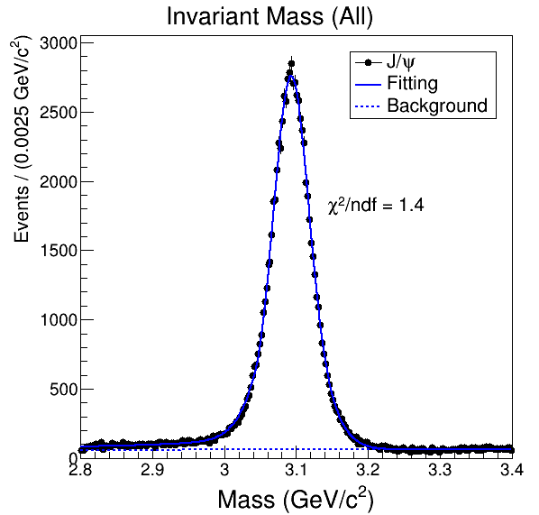
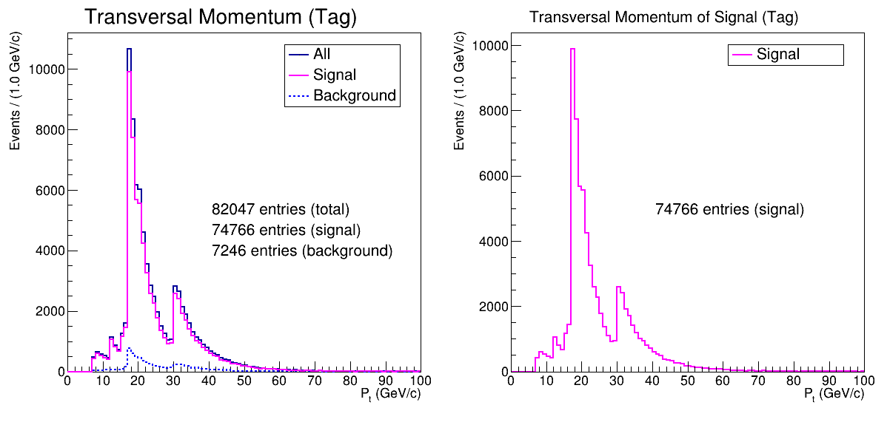
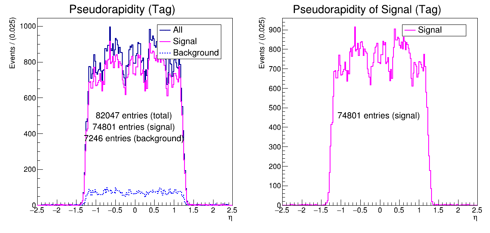
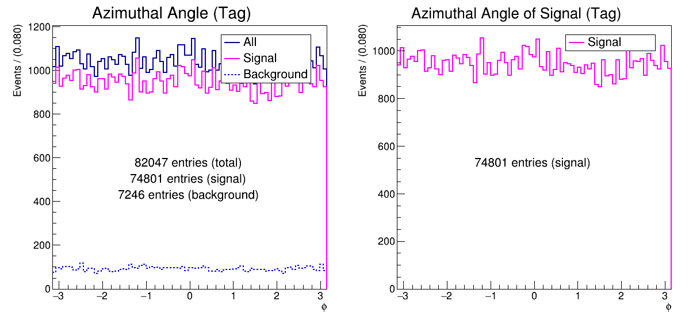
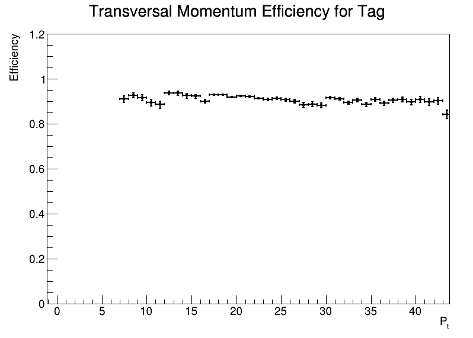
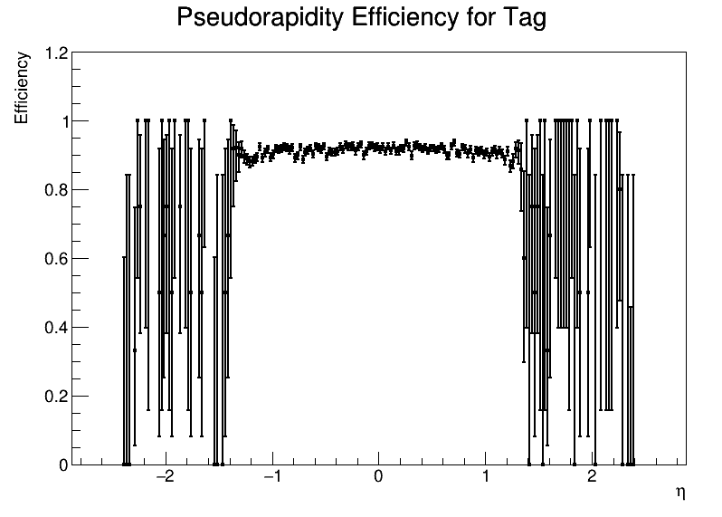
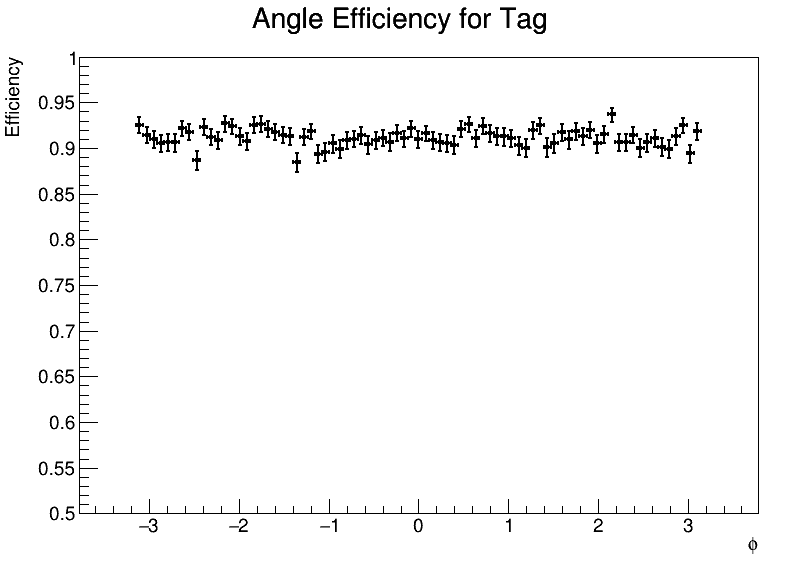

# Tag & Probe Fitting

> Fitting for tag &amp; probe project

## Note

Link to our [Google Drive](https://drive.google.com/drive/folders/1KZ0OyHnHObX_z6l_ZQ3LN4n7lWHzJ9Fy).

## Necessary files and preparation

The analysed datas are from this file:
* [DoubleMu_data_ntuples.tar](https://drive.google.com/file/d/1z4oNmr3Vcv2JOtH-iBxXOFuWCd4llTNe/view?usp=sharing)

After download the file, you will need to merge all `.root` files  in one `data_histoall.root` file and put it in the same diretory of downloaded code. Here follows how to merge the histogram files. Run in the same directory of hisograms:

```sh
$ hadd data_histoall.root *.root
```

## Development setting

It is necessary to have [ROOT](https://root.cern.ch/root/html534/guides/users-guide/InstallandBuild.html), CERN's software, installed on your machine.

Go on your folder where the file code is downloaded and run:

```sh
$ cd master
$ root -l -n
root[0] .L boss.C
root[1] boss()
```

## Generated files and images

Note: The number of candidates were estimated by sideband subtraction.





















## Output
In addition a .root file is generated named `generated_hist.root` with all canvas above and histograms inside.
